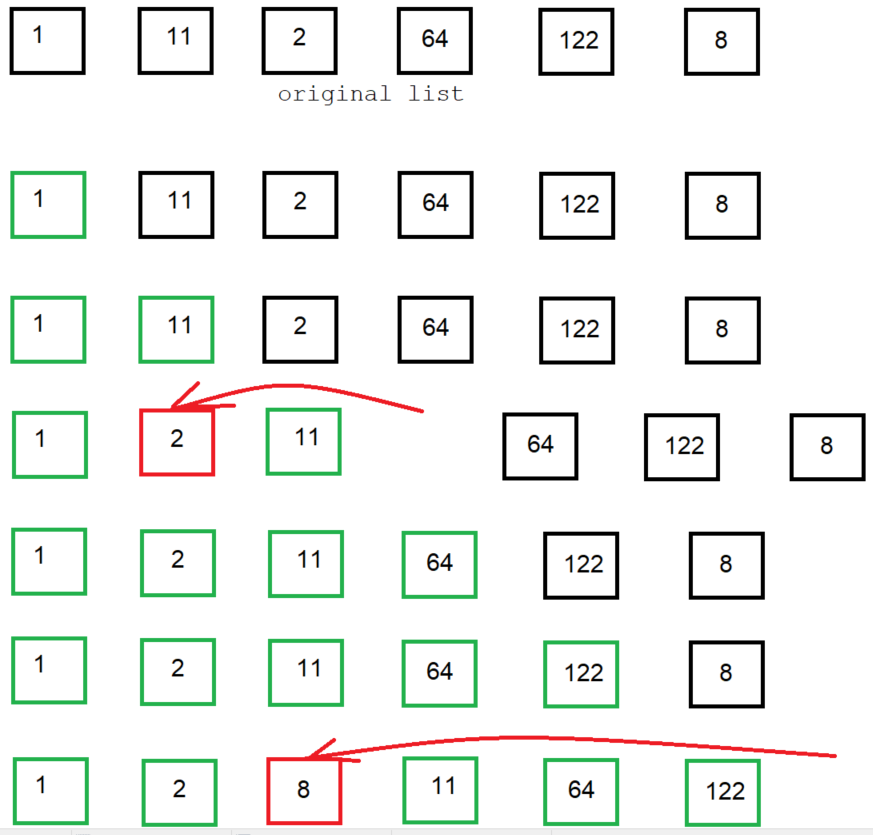
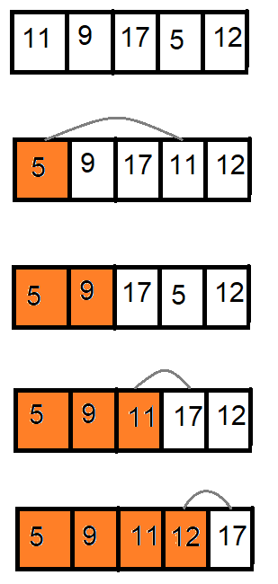
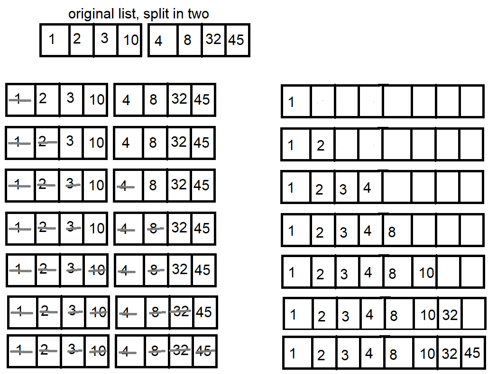

# Sorting algorithms

## Bubble sort
- A simple algorithm which repeatedly iterates through the list, compares adjacent elements, swapping them if they are in the incorrect order.
- Since this method is very costly, it is not a practical solution to use in most circumstances. It is often used simply in teaching of algorithms.

```
Procedure BubbleSort(list)
    n = Length(list)

    Do
        swapped = false

        For (i = 1; i < n; i++)
            If (list[i-1] > list[i])
                // current pair out of order
                // swap them, remember that a change has occurred
                swap list[i-1] and list[i]
                swapped = true
            End If
        End For
    While (swapped)
End Procedure
```
Time complexity:
|Best     |Average |Worst Case|
|---------|--------|----------|
|O(n)     |O(n^2)  |O(n^2)    |
&nbsp;

## Insertion sort
- A simple sorting algorithm that builds the resulting sorted list one element at a time. It is similar to manual sorting of cards in a bridge hand.
- It is not very efficient, but is simple and **stable**. Stability refers to the fact that the relative order of elements with equal keys does not change.

Example:


```
Procedure InsertionSort(list)
// for zero-based arrays
    i = 1
    While (i < list.Length)

        j = i
        While ((j > 0) && (list[j-1] > list[j]))
            Swap(list[j], list[j-1])
            j = j-1
        End While

        i++
    End While
End Procedure

Procedure Swap(x, y)
    temp = x
    x = y
    y = temp
End Procedure
```

Time complexity:
|Best     |Average |Worst Case|
|---------|--------|----------|
|O(n)     |O(n^2)  |O(n^2)    |
&nbsp;

## Selection sort
- A simple algorithm that creates the sorted array one item at a time. It is efficient for small data sets, but quickly becomes inefficient as the number of items increases.
- A sorted "sublist" is gradually built from beginning to end. The smallest (or largest) element in the remaining unsorted portion is found, and is swapped with the leftmost unsorted element, and the sorted portion is then advanced by one element.

- The first step is to find the smallest element in the list, which is then placed at the beginning of the list. The element originally at the beginning of the list is simply moved to where the smallest element initially was (i.e. it is swapped with that element), since we don't yet know where it should be placed. The first element is now part of the sorted sublist.
- Next, we take the minimum of the remaining elements, and perform the swap, and continue the process.


```
Procedure SelectionSort(list)
    For (int next = 0; next < list.Size-1; next++)
        // find the position of the minimum
        int minPos = GetMinPos(list, next, list.Size-1)

        If (minPos != next)
            Swap(list[minPos], list[next])
        End If
    End For
End Procedure

Procedure Swap(x, y)
    temp = x
    x = y
    y = temp
End Procedure

Function GetMinPos(list, from, to)
    minPos = from
    For (int i = from+1, i <= to; i++)
        If (list[i] < list[minPos])
            minPos = i
        End If
    End For

    return minPos
End Function
```

Time complexity:
|Best     |Average |Worst Case|
|---------|--------|----------|
|O(n)     |O(n^2)  |O(n^2)    |
&nbsp;

## Merge sort
- A comparison-based, divide-and-conquer algorithm. It is efficient and fit for general purpose. It was invented by John von Neumann in 1945.

- Suppose we have a list of items. First, we naively assume that the first half is already perfectly sorted, and so is the second half.
- Now, we merge the two presumably sorted lists into one. This is done by adding an element to the resulting list from either the first or second sublist, whichever is smaller.

- The first and second halves of the list must still be sorted. The algorithm actually keeps dividing each half into smaller and smaller sublists, sorting each and merging them back together.
```
Procedure MergeSort(list, from, to)
    If (from == to)
        return
    End If

    int mid = (from + to) / 2

    // sort the first and second halves
    MergeSort(list, from, mid)
    MergeSort(list, mid+1, to)
    Merge(list, from, mid, to)
End Procedure

Procedure Merge(list, from, mid, to)
    // size of the range to be merged
    int n = to - from + 1

    list b // temp vector

    int i1 = from
    int i2 = mid + 1
    int j = 0

    While (i1 <= mid && i2 <= to)
        If (list[i1] < list[i2]>)
            b[j] = list[i1]
            i1++
        Else
            b[j] = list[i2]
            i2++
        End If

        j++
    End While

    // copy remaining entries from the first half
    While (i1 <= mid>)
        b[j] = list[i1]
        i1++
        j++
    End While

    // copy remaining entries from the second half
    While (i2 <= to)
        b[j] = list[i2]
        i2++
        j++
    End While

    // copy back from the temporary vector
    For (j = 0; j < n; j++)
        list[from+j] = b[j]
    End For
End Procedure
```

Time complexity:
|Best     |Average |Worst Case|
|---------|--------|----------|
|O(n*log(n))|O(n*log(n))|O(n*log(n))|
&nbsp;

## QuickSort
TODO

## Shellsort
TOPO

# Searching algorithms
## Linear search
- Simple algorithm which performs a sequential check of each element in the list, until the match has been found, or no match has been found after the whole list has been covered.
- Whilst performance of this algorithm is not especially bad, there exist others, such as binary search, which offer better performance. Thus, it is not as practical to use.

```
Function LinearSearch(list, value)
    For (int i = 0; i < list.Length; i++)
        If (list[i] == value)
            return true
        End If
    End For

    return false
End Function
```

Time complexity:
|Best     |Average |Worst Case|
|---------|--------|----------|
|O(1)     |O(n/2)  |O(n)      |
&nbsp;

## Binary search
- Finds an item in a *sorted* list by repeatedly chopping the list in two. Compares target value to that of the item in the middle of the list, and the half which cannot contain the value is eliminated, and the process is repeated. If the search ends with the remaining sublist being empty, the target item does not exist in the list.
- Faster than linear search, except for very small lists.

```
Function BinarySearch(list, value)
    low = 1
    high = list.Count-1
    found = false

    While (low <= high)
        middle = floor((low+high)/2)

        If (list[middle] < value)
            low = middle+1
        Else If (list[middle] > value)
            high = middle-1
        Else
            return middle
        End If
    End While

    return null or default value
End Function
```

Time complexity:
|Best     |Average |Worst Case|
|---------|--------|----------|
|O(1)     |O(log(n))  |O(log(n))      |
&nbsp;