# Linked list
Data stored in nodes, where each element has a reference to the next. This allows for efficient insertion and removal of elements from any position during iteration. Access is linear (relatively slow), in contrast to arrays, which provide constant-time access.

## Singly-linked list
- Each node has a *data* field, and a *next* field which is a reference to the next node
- The last node is linked to a terminator, or `null`
- The first node is known as the *head*

Example:
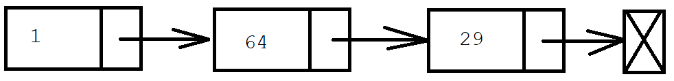

### Common operations/algorithms
#### Traversal
```
currNode = LinkedList.Head
While (currNode not null)
    // do something with currNode.Data...

    currNode = currNode.Next
End While
```

#### Appending (to the end of the list)
```
Procedure Append(T item)
    Create a new Node
    NewNode.Data = item

    If (no nodes in LinkedList)
        Head = NewNode
    Else
        Traverse the list to the last node
        Add NewNode to the end of the list
    End If
End Procedure
```
#### Inserting a node at beginning of the list
```
Procedure InsertBeginning(T item)
    Create a new Node
    NewNode.Data = item

    NewNode.Next = LinkedList.Head
End Procedure
```
#### Inserting a node at the proper position
```
Procedure Insert(T item)
    Create a new Node
    NewNode.Data = item

    If (no nodes in LinkedList)
        // make the new node the first node
        NewNode.Next = LinkedList.Head
        LinkedList.Head = NewNode
    Else
        // find the first node whose value is >= new value, or the end of
        // the list (whichever comes first)

        // insert the new node before the found node, or at the end of 
        // the list
    End If
End Procedure
```

#### Removing first node in the list
```
Procedure RemoveFirst
    // remove first node
    obsoleteNode = LinkedList.Head

    // point past deleted node
    LinkedList.Head = LinkedList.Head.Next

    destroy obsoleteNode
End Procedure
```

#### Removing last node in the list
```
Procedure RemoveLast
    If (no nodes in LinkedList)
        Return
    Else
        Traverse the list to the last node
        Set the second last node's next node to null

        destroy the last node
    End If
End Procedure
```

Since backwards iteration is impossible, efficient operations to insert or remove a node before a specified node are not possible.

Time complexity:
|         |Average |Worst Case|
|---------|--------|----------|
|Access   |O(n)    |O(n)      |
|Search   |O(n)    |O(n)      |
|Insertion|O(1)    |O(1)      |
|Deletion |O(1)    |O(1)      |
&nbsp;

## Doubly-linked list
- Each node contains a *data* field and two references, one for the *previous* node and one for the *next* node.
- The beginning and ending nodes' references a terminator, or `null`.
- The double links allow for efficient insertion of nodes before or after a specified node.

Example:
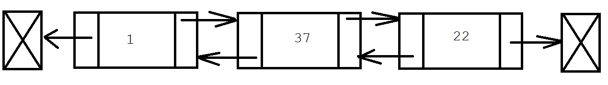

## Common operations/algorithms
#### Traversal
```
// forwards traversal
currNode = LinkedList.Head
While (currNode is not null)
    // do something with currNode.Data...

    currNode = currNode.Next
End While

// backwards traversal
currNode = LinkedLast.LastNode
While (currNode is not null)
    // do something with currNode.Data...

    currNode = currNode.Prev
End While
```

#### Node insertion before or after a specific node
```
// before a given node
Procedure InsertBefore(newNode, node)
    newNode.Next = node

    If (node.Prev is null)
        newNode.Prev = null
        LinkedList.FirstNode = newNode
    Else
        newNode.Prev = node.Prev
        node.Prev.Next = newNode
    End If

    node.Prev = newNode
End Procedure

// after a given node
Procedure InsertAfter(newNode, node)
    newNode.Prev = node

    If (node.Next is null)
        newNode.Next = null
        LinkedList.LastNode = newNode
    Else
        NewNode.Next = node.Next
        node.Next.Prev = newNode
    End If

    node.Next = newNode
End Procedure
```

#### Removing a node
```
Procedure Remove(node)
    If (node.Prev is null)
        LinkedList.FirstNode = node.Next
    Else
        node.Prev.Next = node.Next
    End If

    If (node.Next is null)
        LinkedList.LastNode = node.Prev
    Else
        node.Next.Prev = node.Prev
    End If
End Procedure
```

Time complexity:
|         |Average |Worst Case|
|---------|--------|----------|
|Access   |O(n)    |O(n)      |
|Search   |O(n)    |O(n)      |
|Insertion|O(1)    |O(1)      |
|Deletion |O(1)    |O(1)      |
&nbsp;

# Skip list
- A **probabilistic** (employing a degree of randomness in its logic) data structure that allows efficient searching and insertion, with an ordered sequence of elements.
- It combines the best features of sorted arrays (searching) and linked lists (insertion).
- Invented by William Pugh in 1989

- A skip list is made up of layers of lists. The bottom layer is a linked list.

Time complexity:
|         |Average |Worst Case|
|---------|--------|----------|
|Search   |O(log(n))|O(n)     |
|Insertion|O(log(n))|O(n)      |
|Deletion |O(log(n))|O(n)      |
&nbsp;

# Stack
A **stack** is an ADT that mimics a stack of plates, where removal is only possible from the top. It supports two main operations:
- push - adds an element to the top of the stack
- pop - removes the most recently added element yet to be removed

This behaviour is known as LIFO (Last-in, first-out).

Additional operation:
- peek - retrieves the item at the top, without removing it from the stack. Can be achieved via a pop followed by a push operation to return the item to the stack.

If the stack is empty, a stack underflow will occur upon execution of peek or pop.

A stack can be implemented using either an array or linked list.

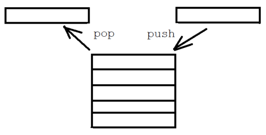

## Array implementation
```
Class Stack
    int maxSize
    int top
    array items

    Constructor(int size)
        this.maxSize = size
        this.items = new array[size]
        this.top = 0 // reports number of items pushed so far
    End Constructor

    Procedure Push(item)
        If (this.top == this.maxSize)
            report overflow error
        Else
            this.items[this.top] = item
            this.top = this.top + 1
        End If
    End Procedure

    Function Pop()
        If (this.Top = 0)
            report underflow error
        Else
            this.Top = this.Top - 1
            item = this.items[this.top]

            return item
        End If
    End Function
End Class
```

## Singly-linked list implementation
```
Class Stack
    Node head
    int numItems

    Class Node
        T Item
        Node Next
    End Class

    Procedure Push(item)
        Node oldHead = this.head
        this.head = new Node()
        this.head.Next = oldHead
        numItems++
    End Procedure

    Function Pop
        If (Head is null)
            Item = this.Head.Item
            this.Head = this.Head.Next
            this.numItems--

            return Item
        Else
            return null
        End If
    End Function
End Class
```

## Applications/use cases
- required for depth-first search
- backtracking
- expression evaluation and syntax parsing

# Queue
A **queue** is a collection of items maintained in a sequence, where items can be added at one end and removed at the other. It supports two main operations:
- enqueue - adding an element to the rear of the queue
- dequeue - removing an element from the front of the queue
Other operations:
- peek

This behaviour is known as FIFO (First-in, first-out).

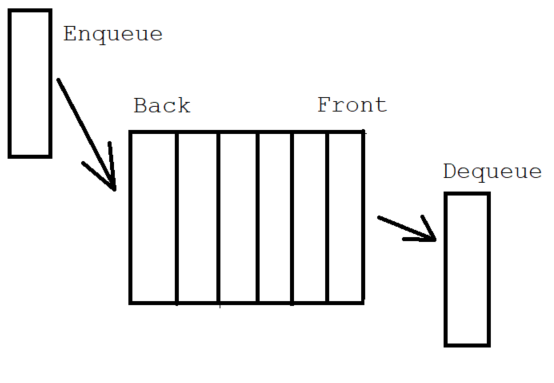

## Singly-linked list implementation
```
Class Queue
    Node first // least recently added node
    Node last // most recently added node
    int n // number of items on the queue

    Class Node
        T Item
        Node Next
    End Class

    Procedure Enqueue(item)
        // add item to the end of the linked list

        Node oldLast = last
        last = new Node()
        last.Item = item
        last.Next = null
        
        If (this.IsEmpty)
            first = last
        Else
            oldLast.Next = last
        End If

        n++
    End Procedure

    Function Dequeue()
        // remove item from the beginning of the linked list

        Item item = first.Item
        first = first.Next
        n--

        If (this.IsEmpty)
            last = null
        End If

        return Item
    End Function
End Class
```

## Applications/use cases
- breadth-first search
- other scenarios where objects must wait to be processed

Time complexity:
|         |Average |Worst Case|
|---------|--------|----------|
|Search   |O(n)    |O(n)      |
|Insertion|O(1)    |O(1)      |
|Deletion |O(1)    |O(1)      |
&nbsp;

# Deque
A **deque** is a double-ended queue. It supports adding and removing items at both ends.

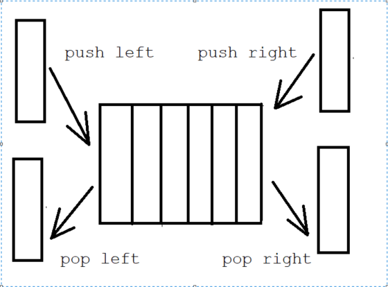

It may be implemented using a doubly-linked list.

# Steque
A **steque** (stack-ended queue) is an ADT that supports `push`, `pop` and `enqueue`. It can be implemented using a linked list.

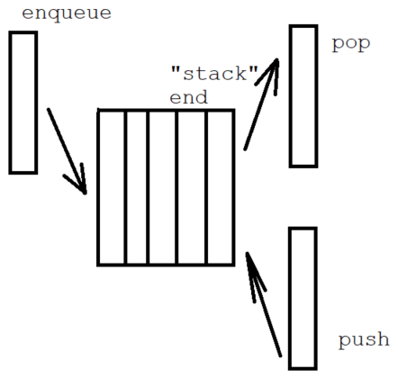

# Bag
A **bag** is a simple data structure that only supports adding items. Removing items is not allowed. The only other operation that can be done is iteration over all the items.

# Associative array
An **associative array** is an ADT that is composed of a collection of (key,value) pairs. Keys cannot have duplicates, while values can have duplicates. The supported operations are:
- add - add a KV pair
- remove - remove a KV pair
- modify - change the key or value of a KV pair
- lookup - retrieve a value associated with a particular key

The two common ways of implementing this data structure are using hash tables and search trees.

## Hash table implementations
- A hash table uses a **hash function** to calculate an **index (hash code)** for a given value. The value will be found in an array of **buckets (slots)**.
- Ideally, each key will be assigned to a unique bucket. However, most hash functions are imperfect, and will cause **collisions** (where multiple keys are mapped to the same index). There are mechanisms for dealing with such cases in most implementations.
- Usually, the hashing makes for very fast operations. However, if multiple hashing collisions start occurring, it can slow down.

The hashing operation is often carried out as follows:
```
hash = hash_function(key)
index = hash % array_size
```
The problem to solve is choosing the right hash function.

Example:
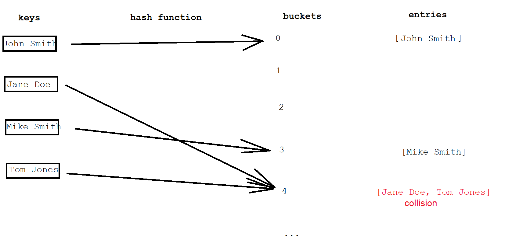

Time complexity:
|         |Average |Worst Case|
|---------|--------|----------|
|Search   |O(1)    |O(n)      |
|Insertion|O(1)    |O(n)      |
|Deletion |O(1)    |O(n)      |

## Search tree implementations
TODO

# Binary search tree
- A rooted (tree starts at a single root node) binary (each node has two children) tree which satisfies the condition that for each node, nodes in the right subtree are greater than those in the left subtree. 
- Invented in 1960.
- The elements stored must be comparable in the language in which it is being implemented.

Example:

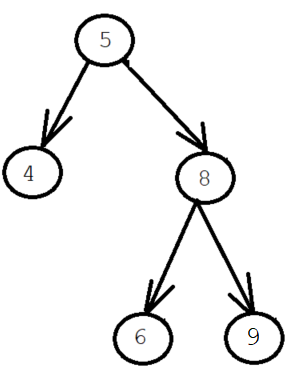


Time complexity:
|         |Average |Worst Case|
|---------|--------|----------|
|Search   |O(log(n))|O(n)     |
|Insertion|O(log(n))|O(n)     |
|Deletion |O(log(n))|O(n)     |

# Red-black tree
- A type of binary search tree that is **balanced** (guaranteed height of O(log(n)) for n items). It is **self-balancing** (height automatically kept small in the face of item insertions and deletions).
- It has the same properties as a binary search tree, with the extra requirement of each node having a "colour", either red or black. The root node and leaves (NIL) are always black.
- If a node is red, then all its children are black.
- All paths from a node to its NIL descendants contain the same number of black nodes (not counting the starting node).
- Each node has its own "black height".
- Invented by Rudolf Bayer in 1972

Example:
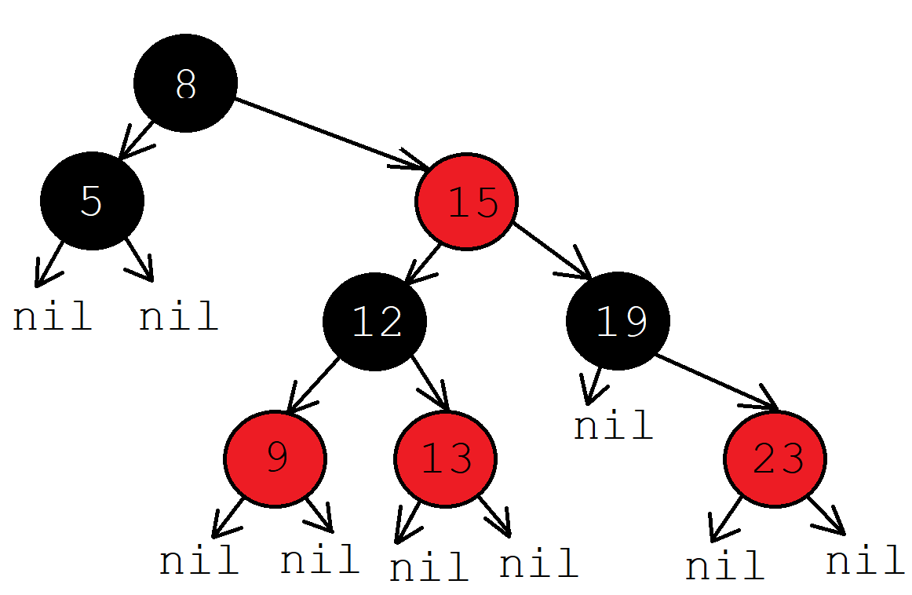

## Operations
### Searching

### Rotation
- Involves rearranging subtrees, with the goal to decrease the tree's height (maximum height of O(log(n))). To accomplish this, larger subtrees are moved up the tree, and smaller subtrees down the tree.
- does not affect order of elements (smaller elements to the left, larger elements to the right)
- To understand the mechanism of rotation, note that the order of leaves, and the property that a left child must be less than a right child, cannot change.
- there are two types of rotation: left and right.
- Time complexity: O(1)
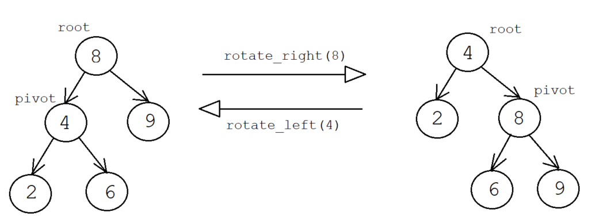
```
pivot = root.opposite_side
root.opposite_side = pivot.rotation_side
pivot.rotation_side = root
root = pivot
```
#### Left rotation
```
Private Procedure RotateLeft(T, Node x)
    // create a node y from x's RH child
    // turn y's LH subtree into x's RH subtree
    y = x.Right
    x.Right = y.Left
    y.Left.Parent = x
    y.Parent = x.Parent

    If (x.Parent is null)
        T.root = y
    Else If (x == x.Parent.Left)
        x.Parent.Left = y
    Else
        x.Parent.Right =y
    End If

    y.Left = x
    x.Parent = y
End Procedure
```
#### Right rotation
```
Private Procedure RotateRight(T, Node x)
    // create a node y from x's LH child
    // turn y's RH subtree into x's LH subtree
    // RH subtree of y gets a new parent
    // y's parent is now x's parent
    y = x.Left
    x.Left = y.Right
    y.Right.Parent = x

    If (x.Parent is null)
        T.root = y
    Else If (x == x.Parent.Left)
        x.Parent.Left = y
    Else
        x.Parent.Right = y
    End If

    y.Right = x
    x.Parent = y
End Procedure
```
### Insertion
- requires **Rotation**
- insert new node, and colour it RED
- recolour and rotate nodes to fix RBT violation:
1. if new node is Root -> colour it BLACK
2. if new node's uncle is RED -> RECOLOUR its parent, grandparent and uncle
3. if new node's uncle is BLACK (Triangle) -> ROTATE new node's parent
4. if new node's uncles is BLACK (line) -> ROATE new node's grandparent and RECOLOUR
```
Procedure Insert(T value, Node z)
    y = null
    x = T.root

    While (x != null)
        y = x

        If (z.Value < x.Value)
            x = x.Left
        Else
            x = x.Right
        End If
    End While

    z.Parent = y
    
    If (y = null)
        T.root = z
    Else If (z.Value < y.Value)
        y.Left = z
    Else
        y.Right = z
    End If

    z.Left = null
    z.Right = null   
    z.Color = RED

    InsertFixup(T,z)

End Procedure

// High-level description
Procedure InsertFixup(T, Node z)
    While (z.Parent is RED)
        y = z's uncle
        If (y is RED)
            Colour parent and uncle BLACK
            Colour grandparent RED
            z = z.grandparent
        Else
            If (zig-zag)
                parent = z
                rotate to zig zag
            End If
        End If
    End While
End Procedure
```
### Removal
- requires **Rotation**

## Applications/use cases
- since they offer worst-case performance guarantees for insertion, deletion, and searching, they are valuable in time-sensitive applications
- computational geometry
- functional programming
- associative arrays
- the C++ STL set, multiset, map and multimap implementations
- the Java TreeMap implementation of NavigableMap

Time complexity:
|         |Average |Worst Case|
|---------|--------|----------|
|Search   |O(log(n))|O(log(n))     |
|Insertion|O(log(n))|O(log(n))     |
|Deletion |O(log(n))|O(log(n))     |

# Graph
- A graph is an ADT consisting of a set of *vertices (nodes or points)*, and a set of *edges* connecting them.
- normally, we number the vertices 0 to V-1 in a graph with V vertices, to make it easier to write code using arrays.

## Definitions
- **self-loop** - an edge that connects a vertex to itself
- **parallel** - two edges that connect the same pair of vertices
- **anomaly** - any self-loop or parallel loops
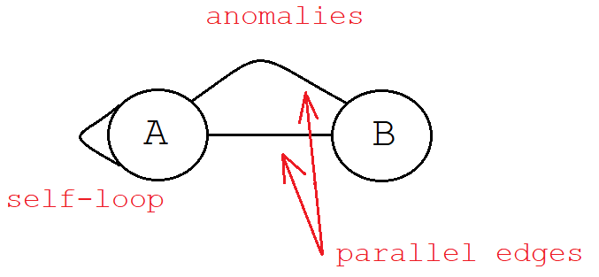

- **path** a sequence of vertices connected by edges, with no repeated edges
- **simple path** - path with no repeated vertices
- **cycle** - path with at least one edge whose first and last vertices are the same
- **simple cycle** - cycle with no repeated vertices (except the first and last vertices)
- **length** - number of edges in a path or cycle

- **connected graph** - has a path from every vertex to every other vertex
- **acyclic graph** - has no cycles
- **tree** - an acyclic connected graph
- **forest** - a disjoint set of trees
- **bipartite graph** - a graph whose vertices can be divided into two sets, so that all edges connect a vertex in one set with a vertex in the other set